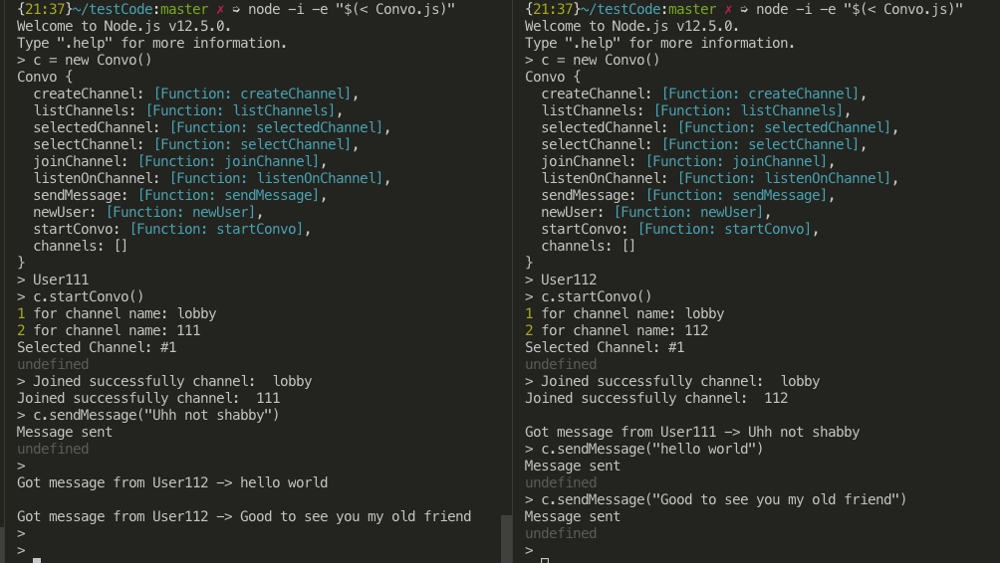

# ConvoCLI
Convo is a class for creating CLI programs with real time conversations via websockets.  
Designed to be used with [WeMeApi (branch ConvoCli)](https://github.com/qqdipps/WeMe-Api/tree/ConvoCli)

## Getting Started
$` node -i -e "$(< Convo.js)"`     
>` c = new Convo`      
>` c.startConvo();`    

